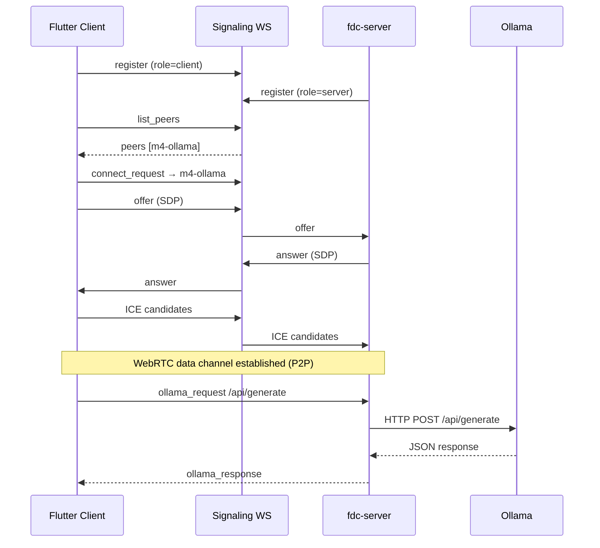

# Architecture

## Goals

1. **Thin FFI** — minimal surface between Dart and libdatachannel
2. **Three modes** — client, server, hybrid with enforced capabilities
3. **Ollama use case** — run inference on a desktop server; query from any Flutter client
4. **Server without Flutter** — `fdc-server` as a standard headless service
5. **pub.dev ready** — standalone package importable via Git or pub.dev

## Layer diagram

```
┌──────────────────────────────────────────────────────────────┐
│                     Flutter Application                      │
├──────────────────────────────────────────────────────────────┤
│  DataChannelClient │ DataChannelServer │ DataChannelHybrid   │
├──────────────────────────────────────────────────────────────┤
│                   DataChannelEngine (Dart)                   │
│         NativeCallable callbacks + StreamControllers         │
├──────────────────────────────────────────────────────────────┤
│              bindings.g.dart (dart:ffi / ffigen)             │
├──────────────────────────────────────────────────────────────┤
│                     fdc_ffi.h (C ABI)                      │
├──────────────────────────────────────────────────────────────┤
│  fdc_ffi.cpp │ SignalingClient │ OllamaProxy                 │
├──────────────────────────────────────────────────────────────┤
│                   libdatachannel (C++ / C)                   │
├──────────────────────────────────────────────────────────────┤
│              usrsctp │ libjuice │ OpenSSL │ …                │
└──────────────────────────────────────────────────────────────┘
```

## Signaling vs data plane

| Plane | Transport | Content |
|-------|-----------|---------|
| **Signaling** | WebSocket to broker | SDP, ICE candidates, peer registry |
| **Data** | WebRTC SCTP data channel | Ollama request/response envelopes |

Keeping signaling separate allows:
- Lightweight Python/Node broker deployment
- No application data through the broker
- Standard WebRTC negotiation pattern

## Session flow (client → server)



## Mode design

### Client-only

- Registers with signaling as `client`
- May call `fdc_connect(peer_id)` to initiate negotiation
- Creates data channel as **offerer**
- Cannot process incoming offers (`handleSignalingMessage` ignores offers in client mode)

### Server-only

- Registers as `server`
- Accepts incoming offers, creates **answerer** data channels
- Runs `OllamaProxy` for `ollama_request` messages
- `fdc_connect` returns `FDC_ERR_MODE_DENIED`

### Hybrid

- Both offerer and answerer paths enabled
- Useful for edge nodes that relay or participate in mesh topologies

## FFI design principles

1. **Opaque context** — `FdcContext*` hides C++ state
2. **Callback-based events** — no polling; Dart uses `NativeCallable.listener`
3. **String ownership** — config strings copied at `fdc_create`; callbacks borrow pointers
4. **Thread safety** — mutex on context; callbacks may fire from libdatachannel threads

## Ollama proxy

Server-side `OllamaProxy` uses a minimal HTTP/1.1 client over BSD sockets:
- No libcurl dependency
- Localhost/LAN HTTP only (`http://` — no TLS in v0.1)
- Suitable for default Ollama deployment on `127.0.0.1:11434`

Future: chunked streaming for `stream: true` Ollama responses.

## Flutter plugin packaging

Each platform's `CMakeLists.txt` adds `native/` as a subdirectory and exports the built library via `flutter_*_bundled_libraries` for the Flutter tool to bundle.

| Platform | Linking |
|----------|---------|
| Linux | `libflutter_datachannel.so` |
| macOS | `libflutter_datachannel.dylib` |
| Windows | `flutter_datachannel.dll` |
| Android | `libflutter_datachannel.so` per ABI |
| iOS | Static `fdc_ffi` linked into Runner |

## Extension points

| Extension | Location |
|-----------|----------|
| New message types | `fdc_ffi.cpp` `onMessage` handler |
| Auth on signaling | `tools/signaling_server.py` |
| webrtc.rs backend | New `native-rs/` crate, same `fdc_ffi.h` |
| TURN auto-config | `FdcConfig` + Dart `DataChannelConfig` |

## Security considerations (v0.1)

- No signaling authentication (add tokens before production)
- No DTLS cert pinning exposed in API
- Ollama proxy trusts all connected peers — restrict via network + signaling auth
- Use `wss://` and `https://` signaling in production deployments
